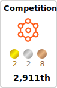
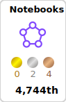

## Hi there 👋

> 🔭 I’m a passionate Research Data Scientist, getting my hands dirty
  developing various AI tools 

<!-- 

 
-->

  
  
  <!--  -->

<!--   -->
<!-- 

 -->

 

## Competitions 

- [Google Research: Identify Contrails to Reduce Global Warming](https://www.kaggle.com/certification/competitions/imeintanis/google-research-identify-contrails-reduce-global-warming)
    > Rank: 11/954 (Top: 1%)

- [Tensorflow: Help Protect the Great Barrier Reef ](https://www.kaggle.com/certification/competitions/imeintanis/tensorflow-great-barrier-reef)
    > Rank: 11/2025 (Top: 1%)
  
- [American Express: Default Prediction]([https://comp-1/](https://www.kaggle.com/certification/competitions/imeintanis/amex-default-prediction))
    > Rank: 13/4874 (Top: 1%)

- [EYDAP Innovation Challenge (Part B)]() 
    > Rank: 2nd

 

## Awards 

- IKY Scholarship for Postgraduate studies abroad (IKY, Greece)
  > Issued by State Scholarships Foundation (IKY), Greece, 09/2009 
    Associated with Piraeus University of Applied Sciences
    
    > Ranked 1st (Upon examination on 3 special courses)
        Duration: 3+1 Years

- Bursary for Research Studies
  > Issued by School of Mathematics, Computer Sciences and Engineering, City University London, 10/2010 
  
  Distinguished 1st in MSc Program 2009-10
 
- Conference Travel Fund Award
  > Issued by School of Mathematics, Computer Sciences and Engineering, City university London · 06/2014

## My Best Skills

<!-- https://github.com/tandpfun/skill-icons#readme -->

<!-- terraform, elasticsearch, js,npm, -->

 

<!-- 

 

-->

