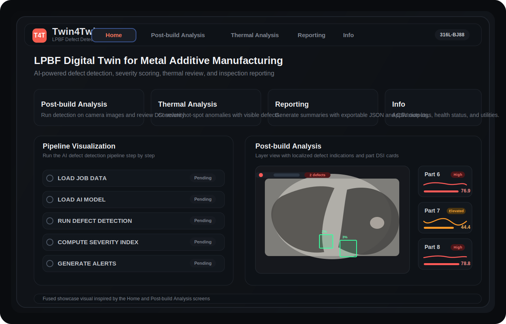
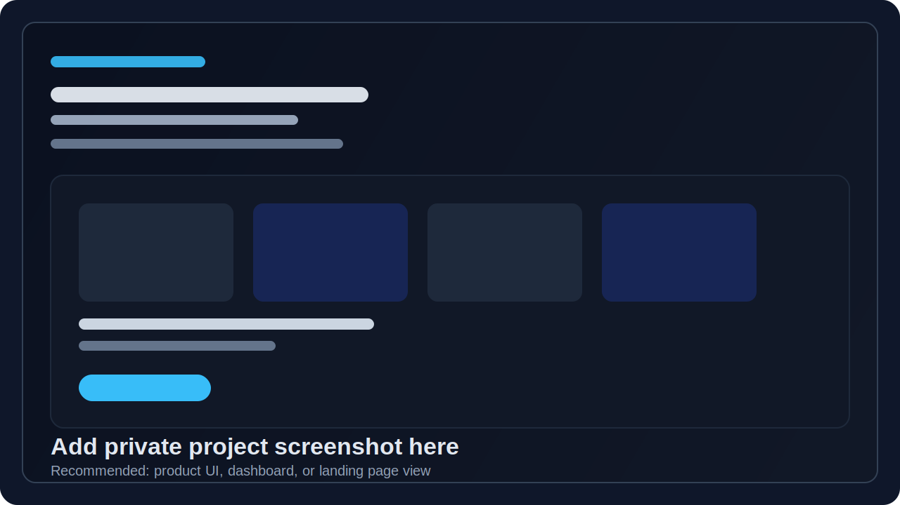
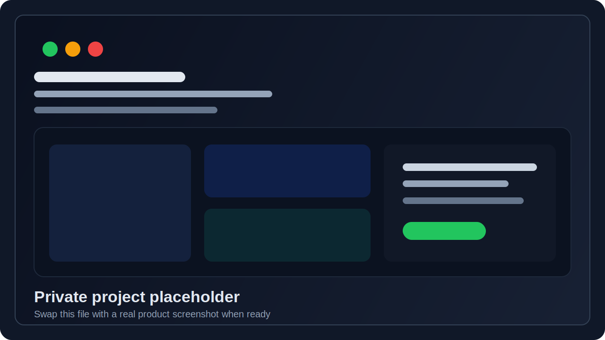
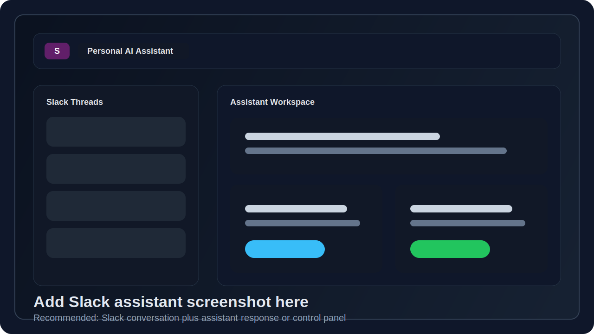

<h1 align="center">Hi there 👋</h1>

  Research Data Scientist and full stack developer. I enjoy turning research ideas into real-world solutions across machine learning, data platforms, and modern web applications.

## Languages & Tools

**Languages**

**AI / Data**

**AI coding**

**Frameworks / Platforms**

**Agentic Frameworks**

**Cloud / Dev Tools**

**Web3**

<!--  -->

## Featured Projects (coming soon..)

<table>
  <tr>
    <td width="60%" valign="top">
      <h3>Automated Defect Detection for LPBF Additive Manufacturing</h3>
      

        AI-powered digital twin for Laser Powder Bed Fusion metal 3d printing, combining post-build defect analysis, defect severity scoring, thermal analysis, and inspection reporting in a single interface.
      

      

        <strong>Tech stack</strong> 
        Python, PyTorch, YOLO, Kafka, streamlit, React.js
      

      

        <strong>EU Project(s):</strong> Twin4Twin
      

      

        <strong>Repository:</strong> Private company repository
      

      

        <strong>Video:</strong> [Link to public video coming soon..]
      

    </td>
    <td width="40%" valign="center">
      
    </td>
  </tr>
</table>

 

<table>
  <tr>
    <td width="60%" valign="top">
      <h3>Energy Management Systems for Industrial Plants</h3>
      

        Energy-aware optimisation and decision-support platform for industrial plants, focused on energy availability, price signals, KPIs, operational constraints,
        and optimization across equipment, utilities, and operational processes.
      

      

        <strong>Tech stack</strong> 
        Python, pyomo, streamlit
      

      

        <strong>EU Project(s):</strong> TRINEFLEX
      

      

        <strong>Repository:</strong> Private company repository
      

    </td>
    <td width="40%" valign="top">
      
    </td>
  </tr>
</table>

 

<table>
  <tr>
    <td width="60%" valign="top">
      <h3>A Multi-agent system as Knowledge-base Assistant</h3>
      

        Multi-agent assistant designed to answer domain questions over internal knowledge sources, coordinate specialized reasoning steps, and support daily enterprise workflows with grounded responses.
      

      

        <strong>Tech stack</strong> 
        Python, google-adk, LLM orchestration, RAG, vector search
      

      

        <strong>Repository:</strong> Private company repository
      

    </td>
    <td width="40%" valign="top">
      
    </td>
  </tr>
</table>

 

<table>
  <tr>
    <td width="60%" valign="top">
      <h3>Personal AI Assistant with Slack Integration</h3>
      

        Conversational AI assistant integrated into Slack to support team Q&amp;A, summarize discussions,
        surface useful context, and automate day-to-day knowledge work.
      

      

        <strong>Tech stack</strong> 
        Slack API, Python, FastAPI, LLMs, embeddings, automation workflows
      

      

        <strong>Repository:</strong> [coming soon..]
      

    </td>
    <td width="40%" valign="top">
      
    </td>
  </tr>
</table>

 

<table>
  <tr>
    <td width="60%" valign="top">
      <h3>Distric Heating System Optimisation - Vransko Use case</h3>
      

        Optimization and decision-support platform for district heating operations, focused on energy efficiency,
        demand-supply balancing, and smarter control strategies for the Vransko use case.
      

      

        <strong>Tech stack</strong> 
        Python, optimization models, forecasting, IoT data integration, analytics dashboards, APIs
      

      

        <strong>EU Project(s)</strong> InDeal
      

      

        <strong>Repository:</strong> [coming soon..]
      

    </td>
    <td width="40%" valign="top">
      
    </td>
  </tr>
</table>

## Hackathons

  
  

| Hackathon / Competition | Result | Highlights |
| --- | --- | --- |
| [Google Research: Identify Contrails to Reduce Global Warming](https://www.kaggle.com/certification/competitions/imeintanis/google-research-identify-contrails-reduce-global-warming) | 11 / 954, Top 1% | [Solution writeup](https://www.kaggle.com/competitions/google-research-identify-contrails-reduce-global-warming/writeups/giryn-11th-place-solution-write-up) |
| [TensorFlow: Help Protect the Great Barrier Reef](https://www.kaggle.com/certification/competitions/imeintanis/tensorflow-great-barrier-reef) | 11 / 2025, Top 1% | [Solution writeup](https://www.kaggle.com/competitions/tensorflow-great-barrier-reef/writeups/cots-11th-place-solution-team-cots) |
| [American Express: Default Prediction](https://www.kaggle.com/certification/competitions/imeintanis/amex-default-prediction) | 13 / 4874, Top 1% | [Solution writeup](https://www.kaggle.com/competitions/amex-default-prediction/writeups/ci-2-k-uncle-giba-13th-place-gold-solution) |
| EYDAP Innovation Challenge (Part B) | 2nd place | Innovation challenge finalist result |

